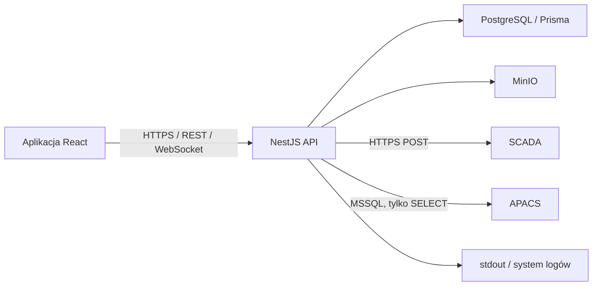
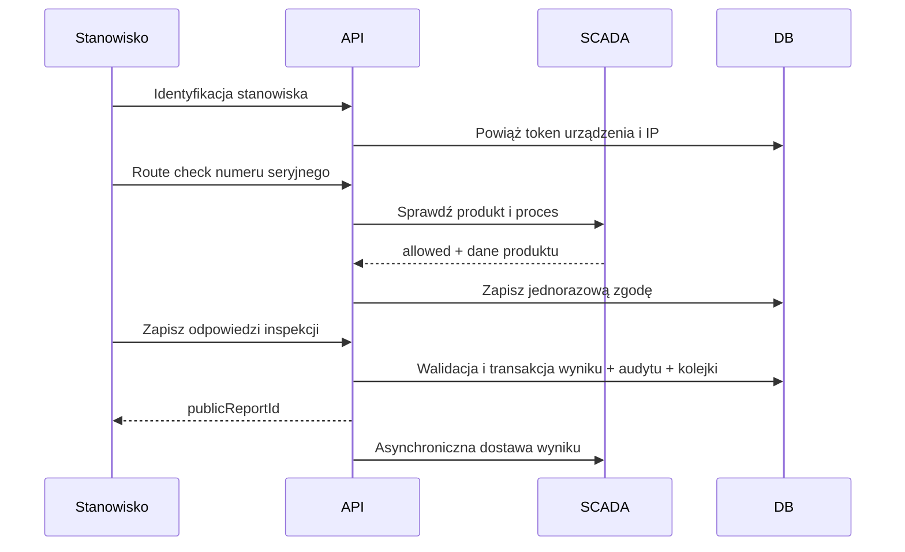

# Architektura

## Cel systemu

Inspect Hub obsługuje cyfrowe kontrole jakości na stanowiskach produkcyjnych.
System łączy identyfikację stanowiska i operatora, wersjonowane formularze,
rejestrację wyników, publiczne raporty, analitykę oraz integrację ze SCADA.

## Komponenty

- `apps/web` — SPA React 19 budowana przez Vite.
- `apps/api` — API NestJS, walidacja DTO, JWT, role oraz WebSocket.
- `packages/database` — schemat Prisma, migracje i klient PostgreSQL.
- `packages/types` — współdzielone kontrakty TypeScript.
- `packages/ui` — współdzielone komponenty interfejsu.
- PostgreSQL — dane domenowe, kolejka SCADA i audyt.
- MinIO — obrazy instrukcji oraz zdjęcia z kontroli.
- APACS — opcjonalne źródło tożsamości operatora korzystającego z karty.

## Moduły API

| Moduł             | Odpowiedzialność                            |
| ----------------- | ------------------------------------------- |
| `auth`            | logowanie hasłem i kartą, JWT, role         |
| `users`           | administracja użytkownikami                 |
| `stations`        | stanowiska, procesy i powiązanie urządzenia |
| `forms`           | formularze, rewizje, archiwizacja           |
| `inspections`     | zapis wyników, raporty, dashboardy, eksport |
| `media`           | walidowany upload i strumieniowanie obrazów |
| `scada-connector` | route check i kolejka dostarczenia wyników  |
| `observability`   | logi HTTP, correlation ID i trwały audyt    |

## Przepływ inspekcji

W trybie produkcyjnym aktywna integracja SCADA wymaga zgodnego, niewykorzystanego
`routeCheckId`. Wynik, zdarzenie `INSPECTION_COMPLETED` i wpis kolejki SCADA są
tworzone w jednej transakcji.

## Granice procesów i dostępność

API jest bezstanowe poza timerem kolejki SCADA. Stan trwały znajduje się w
PostgreSQL i MinIO. Każda instancja API uruchamia proces kolejki co 5 sekund;
blokada `processing` zapobiega równoległemu wykonaniu tylko wewnątrz jednej
instancji. Przy skalowaniu do wielu instancji należy dodać blokadę rozproszoną
lub atomowe przejmowanie rekordów kolejki.

## Adresowanie

- Globalny prefix REST: `/api`.
- WebSocket korzysta z adaptera `ws`.
- W produkcji CORS dopuszcza wyłącznie `WEB_ORIGIN`.
- `TRUST_PROXY=true` wolno ustawić tylko za kontrolowanym reverse proxy.
